# v3.0 Container Architecture

该图展示平台的主要可运行容器和持久化边界。内部 Python package 的进一步拆分属于组件级设计，不在容器图中展开。

```mermaid
C4Container
  title Container Architecture - v3.0 Evidence-Centric Evolution Platform

  Person(operator, "Research Operator", "Runs campaigns and authorizes risky steps")
  Person(reviewer, "Independent Reviewer", "Verifies claims and promotion evidence")

  System_Ext(taskSources, "Task Sources", "Benchmarks and curated task sets")
  System_Ext(modelProviders, "Frozen Model Runtimes", "MLX and remote model APIs")
  System_Ext(nativeHarness, "Native Evaluator Runtimes", "Project and benchmark harnesses")
  System_Ext(probeRuntimes, "Probe Runtimes", "JLens, LB, logit and activation capture")

  System_Boundary(platform, "Evidence-Centric Evolution Platform") {
    Container(productApi, "Product API and CLI", "Python CLI/API", "Goals, campaigns, evidence, capabilities and releases")
    Container(orchestrator, "Portfolio Orchestrator", "Python service", "Routes capability gaps and coordinates strategies")
    Container(kernel, "Campaign Kernel", "Python runtime", "Authorization, budget, lease, checkpoint and lifecycle")
    Container(execution, "Execution Runtime", "Python workers", "Materializes tasks and executes models, tools and evaluators")
    Container(observerHub, "Observer Hub", "Python adapters", "Collects external, internal, outcome, cost and safety evidence")
    Container(strategyHost, "Strategy Host", "Python plugins", "Legacy import, Skill paired A/B and AgentProgram search")
    Container(analysis, "Evidence and Analysis Service", "Python service", "Aligns evidence, derives claims and mechanism hypotheses")
    Container(governance, "Governance Service", "Python service", "Applies gate profiles and records promotion decisions")
    ContainerDb(receiptStore, "Receipt and Artifact Store", "Append-only files/JSONL", "Immutable execution facts and content-addressed artifacts")
    ContainerDb(registries, "Capability and AgentProgram Registries", "Versioned projections", "Validated components and immutable AgentProgram revisions")
  }

  Rel(operator, productApi, "Creates goals and authorizations", "CLI/API")
  Rel(reviewer, productApi, "Queries evidence and records reviews", "Read-only API")
  Rel(productApi, orchestrator, "Submits portfolio goals and campaign requests", "In-process API")
  Rel(orchestrator, kernel, "Schedules authorized campaigns", "Campaign API")
  Rel(kernel, strategyHost, "Requests strategy plans and decisions", "Plugin protocol")
  Rel(kernel, execution, "Dispatches bounded execution plans", "Worker API")
  Rel(execution, taskSources, "Materializes frozen task revisions", "Adapter API")
  Rel(execution, modelProviders, "Requests deterministic inference", "Transport API")
  Rel(execution, nativeHarness, "Runs official validation", "Isolated process")
  Rel(execution, observerHub, "Publishes frozen rollout events", "Observer protocol")
  Rel(observerHub, probeRuntimes, "Collects configured internal observations", "Probe adapter")
  Rel(execution, receiptStore, "Appends runtime and evaluation receipts", "Atomic append")
  Rel(observerHub, receiptStore, "Appends evidence envelopes", "Atomic append")
  Rel(analysis, receiptStore, "Reads facts and appends versioned claims", "Projection API")
  Rel(strategyHost, analysis, "Requests evidence views and proposes hypotheses", "Query API")
  Rel(strategyHost, registries, "Publishes candidates and reads validated assets", "Registry API")
  Rel(governance, receiptStore, "Reads claims and appends gate decisions", "Governance API")
  Rel(governance, registries, "Promotes or retires versioned assets", "Registry state event")

  UpdateLayoutConfig($c4ShapeInRow="4", $c4BoundaryInRow="1")
```

## 容器职责摘要

| 容器 | 不负责什么 |
|---|---|
| Campaign Kernel | 不理解 G0–G3、baseline/taught 或具体机制 |
| Strategy Host | 不直接调用模型、shell、workspace 或 evaluator |
| Observer Hub | 不判断候选是否晋升 |
| Analysis Service | 不修改原始 Receipt，只追加 Claim |
| Governance Service | 不生成候选，只判断证据是否满足门禁 |
| Registries | 不保存运行事实，只保存版本化产品资产投影 |
