# v3.0 Container Architecture

该图标出当前可运行边界：`[LIVE]` 表示当前代码可执行；更广泛的多目标 Portfolio 优化仍属于后续产品扩展。

```mermaid
C4Container
  title Container Architecture - Current Runtime and Target Portfolio Closure

  Person(operator, "Research Operator", "Runs campaigns and supplies explicit authorization")
  Person(reviewer, "Independent Reviewer", "Audits sealed artifacts and promotion evidence")

  System_Ext(taskSources, "Feedback Task Sources", "Frozen catalogs and clean source checkouts")
  System_Ext(modelProviders, "Model Runtimes", "Pinned local Qwen and configured Teacher transport")
  System_Ext(nativeHarness, "Official Native Evaluator", "Pinned benchmark evaluator and harness")

  System_Boundary(platform, "Evidence-Centric Evolution Platform") {
    Container(productCli, "[LIVE] Product CLI", "Python CLI", "Starts and resumes authorized campaigns")
    Container(autonomousRunner, "[LIVE] Autonomous Skill Runner", "Python module", "Selects feedback tasks, proposes inactive revisions, seals rounds and resumes from accepted parents")
    Container(kernel, "[LIVE] Campaign Kernel", "Python runtime", "Checks authorization and lifecycle boundaries")
    Container(execution, "[LIVE] Execution Runtime", "Python runtime", "Executes bounded model, trace and evaluator plans")
    Container(strategyHost, "[LIVE] Strategy Host", "Python strategies", "Runs Legacy import, Skill paired campaigns, fixture and allowlisted non-fixture AgentProgram execution")
    Container(evidence, "[LIVE] Evidence and Governance Modules", "Python modules", "Builds evidence graphs, verifies Claims and applies gates")
    ContainerDb(receiptStore, "[LIVE] Receipt and Artifact Store", "Append-only files", "Stores hash-bound runtime facts, Claims and sealed manifests")
    ContainerDb(registries, "[LIVE] Versioned Registries", "JSONL projections", "Stores inactive Skills, capabilities and AgentProgram revisions")
    Container(capabilityGap, "[LIVE] CapabilityGap Log", "Append-only portfolio facts", "Turns one authoritative AgentProgram failure into a scoped capability gap")
    Container(portfolio, "[LIVE] Portfolio Orchestrator", "Bounded Python orchestrator", "Coordinates one gap-to-inactive-capability-to-tournament path")
  }

  Rel(operator, productCli, "Starts authorized runs and inspects results", "CLI")
  Rel(reviewer, receiptStore, "Audits sealed artifacts and hash-bound evidence", "Read-only files")
  Rel(productCli, autonomousRunner, "Runs or resumes autonomous Skill evolution", "In-process call")
  Rel(productCli, kernel, "Starts explicit strategy campaigns", "In-process call")
  Rel(autonomousRunner, kernel, "Runs baseline and taught Skill campaigns", "Campaign protocol")
  Rel(kernel, strategyHost, "Requests plans and strategy decisions", "Strategy protocol")
  Rel(kernel, execution, "Dispatches admitted execution plans", "Execution protocol")
  Rel(execution, taskSources, "Loads admitted feedback tasks at exact revisions", "Filesystem")
  Rel(execution, modelProviders, "Requests pinned inference", "Transport protocol")
  Rel(execution, nativeHarness, "Runs official feedback evaluation", "Isolated process")
  Rel(execution, receiptStore, "Appends model, trace and native receipts", "Atomic files")
  Rel(evidence, receiptStore, "Reads receipts and appends verified projections", "Hash-verified files")
  Rel(strategyHost, registries, "Writes inactive versioned assets", "Registry protocol")
  Rel(evidence, registries, "Applies explicit verification and governance decisions", "Registry protocol")

  Rel(evidence, capabilityGap, "[LIVE] Emits a verified, scoped gap", "Portfolio protocol")
  Rel(capabilityGap, portfolio, "[LIVE] Starts bounded capability research", "Portfolio request")
  Rel(portfolio, strategyHost, "[LIVE] Requests externally validated Skill evidence", "Injected authority")
  Rel(registries, portfolio, "[LIVE] Returns a Governance-approved inactive component", "Verified registry")
  Rel(portfolio, strategyHost, "[LIVE] Runs a live AgentProgram tournament", "CampaignRunner")

  UpdateLayoutConfig($c4ShapeInRow="4", $c4BoundaryInRow="1")
```

## 容器职责与状态

| 容器 | 当前边界 |
|---|---|
| Autonomous Skill Runner | accepted、已密封且 manifest 验证通过的 round 是下一轮 parent authority；`BEST-HARNESS.json` 只是 hash-verified projection |
| Strategy Host | Skill paired 为 LIVE；Legacy 仅只读兼容导入；AgentProgram fixture 与公开 allowlisted non-fixture profile 均为 LIVE |
| Execution Runtime | 执行 Kernel 已准入的计划；不决定候选是否晋升 |
| Evidence and Governance Modules | 不修改原始 Receipt；验证 Claim 和显式门禁，且不会自动激活 Skill |
| Versioned Registries | 保存版本化资产投影，不替代运行事实和 sealed-round 决策 |
| CapabilityGap Log | **LIVE**：从一个权威失败 Claim 写入 immutable gap，不是第二个 Claim authority |
| Portfolio Orchestrator | **LIVE（最小闭环）**：只连接一条 inactive Skill/Capability 到 live AgentProgram tournament；不自动激活 |

当前最小闭环为 `verified failure → CapabilityGap → Portfolio → local Skill validation → Governance-approved inactive component → live AgentProgram`。跨多个 gap 的优先级学习、全自动资源调度和 production activation 仍不在本版范围。
