# v3.0 Container Architecture

该图同时标出当前可运行边界和跨策略闭环的目标边界：`[LIVE]` 表示当前代码可执行，`[TARGET]` 表示设计目标、尚不可调用或部署。带有 `[TARGET]` 的关系同样不是当前行为。

```mermaid
C4Container
  title Container Architecture - Current Runtime and Target Portfolio Closure

  Person(operator, "Research Operator", "Runs campaigns and supplies explicit authorization")
  Person(reviewer, "Independent Reviewer", "Audits sealed artifacts and promotion evidence")

  System_Ext(taskSources, "Feedback Task Sources", "Frozen catalogs and clean source checkouts")
  System_Ext(modelProviders, "Model Runtimes", "Pinned local Qwen and configured Teacher transport")
  System_Ext(nativeHarness, "Official Native Evaluator", "Pinned benchmark evaluator and harness")

  System_Boundary(platform, "Evidence-Centric Evolution Platform") {
    Container(productCli, "[LIVE] Product CLI", "Python CLI", "Starts and resumes authorized campaigns")
    Container(autonomousRunner, "[LIVE] Autonomous Skill Runner", "Python module", "Selects feedback tasks, proposes inactive revisions, seals rounds and resumes from accepted parents")
    Container(kernel, "[LIVE] Campaign Kernel", "Python runtime", "Checks authorization and lifecycle boundaries")
    Container(execution, "[LIVE] Execution Runtime", "Python runtime", "Executes bounded model, trace and evaluator plans")
    Container(strategyHost, "[LIVE] Strategy Host", "Python strategies", "Runs Legacy import, Skill paired campaigns, fixture CLI and injected non-fixture AgentProgram execution")
    Container(evidence, "[LIVE] Evidence and Governance Modules", "Python modules", "Builds evidence graphs, verifies Claims and applies gates")
    ContainerDb(receiptStore, "[LIVE] Receipt and Artifact Store", "Append-only files", "Stores hash-bound runtime facts, Claims and sealed manifests")
    ContainerDb(registries, "[LIVE] Versioned Registries", "JSONL projections", "Stores inactive Skills, capabilities and fixture AgentProgram revisions")
    Container(capabilityGap, "[TARGET] CapabilityGap Queue", "Not implemented", "Would turn verified failure evidence into schedulable local capability gaps")
    Container(portfolio, "[TARGET] Portfolio Orchestrator", "Not implemented", "Would automatically coordinate gap research and live AgentProgram tournaments")
  }

  Rel(operator, productCli, "Starts authorized runs and inspects results", "CLI")
  Rel(reviewer, receiptStore, "Audits sealed artifacts and hash-bound evidence", "Read-only files")
  Rel(productCli, autonomousRunner, "Runs or resumes autonomous Skill evolution", "In-process call")
  Rel(productCli, kernel, "Starts explicit strategy campaigns", "In-process call")
  Rel(autonomousRunner, kernel, "Runs baseline and taught Skill campaigns", "Campaign protocol")
  Rel(kernel, strategyHost, "Requests plans and strategy decisions", "Strategy protocol")
  Rel(kernel, execution, "Dispatches admitted execution plans", "Execution protocol")
  Rel(execution, taskSources, "Loads admitted feedback tasks at exact revisions", "Filesystem")
  Rel(execution, modelProviders, "Requests pinned inference", "Transport protocol")
  Rel(execution, nativeHarness, "Runs official feedback evaluation", "Isolated process")
  Rel(execution, receiptStore, "Appends model, trace and native receipts", "Atomic files")
  Rel(evidence, receiptStore, "Reads receipts and appends verified projections", "Hash-verified files")
  Rel(strategyHost, registries, "Writes inactive versioned assets", "Registry protocol")
  Rel(evidence, registries, "Applies explicit verification and governance decisions", "Registry protocol")

  Rel(evidence, capabilityGap, "[TARGET] Emits a verified, scoped gap", "Planned protocol")
  Rel(capabilityGap, portfolio, "[TARGET] Queues capability research", "Planned protocol")
  Rel(portfolio, strategyHost, "[TARGET] Schedules a local Skill campaign", "Planned protocol")
  Rel(registries, portfolio, "[TARGET] Returns a validated inactive component", "Planned protocol")
  Rel(portfolio, strategyHost, "[TARGET] Automatically resumes a live AgentProgram tournament", "Planned protocol")

  UpdateLayoutConfig($c4ShapeInRow="4", $c4BoundaryInRow="1")
```

## 容器职责与状态

| 容器 | 当前边界 |
|---|---|
| Autonomous Skill Runner | accepted、已密封且 manifest 验证通过的 round 是下一轮 parent authority；`BEST-HARNESS.json` 只是 hash-verified projection |
| Strategy Host | Skill paired 为 LIVE；Legacy 仅只读兼容导入；AgentProgram 的 fixture CLI 与注入式 non-fixture library/runtime seam 均为 LIVE，但尚无公开 non-fixture executor 配置 |
| Execution Runtime | 执行 Kernel 已准入的计划；不决定候选是否晋升 |
| Evidence and Governance Modules | 不修改原始 Receipt；验证 Claim 和显式门禁，且不会自动激活 Skill |
| Versioned Registries | 保存版本化资产投影，不替代运行事实和 sealed-round 决策 |
| CapabilityGap Queue | **TARGET**：当前没有自动生成或消费 `CapabilityGap` 的运行路径 |
| Portfolio Orchestrator | **TARGET**：当前没有把 Skill 增益自动接入 live AgentProgram seam 的编排器 |

目标闭环为 `verified failure → CapabilityGap → Portfolio → local Skill research → validated inactive component → live AgentProgram → new evidence/failure`；non-fixture AgentProgram 的注入式执行 seam 已存在，但图中的自动编排闭环和公开 executor 配置尚未实现。
