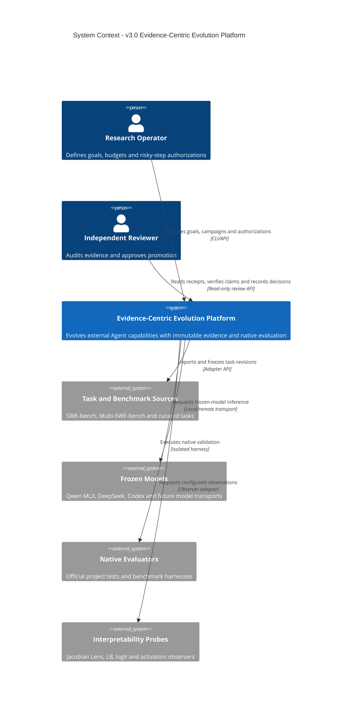

# v3.0 System Context

该图描述 v3.0 Evidence-Centric Evolution Platform 的系统边界及外部参与者。平台不训练模型权重；模型、Benchmark 和原生 evaluator 都作为外部依赖接入。

## 边界说明

- Frozen Models 只执行推理，v3.0 不更新模型权重。
- Interpretability Probes 只产生 Evidence，不拥有晋升权限。
- Native Evaluators 是结果裁判，不能被 Strategy 或 Teacher 修改以适配候选。
- Research Operator 授权成本和风险边界；Independent Reviewer 独立验证晋升证据。
