# v3.0 Dynamic Evolution Flow

该动态图把当前可执行的 autonomous Skill round 与最小跨策略闭环放在同一视图。所有 `[LIVE]` 步骤均由当前代码支持；跨多个 gap 的自动优先级优化仍是后续目标。

```mermaid
C4Dynamic
  title Dynamic Flow - Live Autonomous Skill Round and Target Portfolio Loop

  Person(operator, "Research Operator", "Defines authorization and bounded inputs")

  Container(cli, "[LIVE] Product CLI", "Python CLI", "Starts and resumes campaigns")
  Container(runner, "[LIVE] Autonomous Skill Runner", "Python", "Selects feedback tasks and seals round decisions")
  Container(kernel, "[LIVE] Campaign Kernel", "Python", "Admits plans and controls campaign lifecycle")
  Container(strategy, "[LIVE] Skill Paired Strategy", "Python", "Plans matched baseline and taught execution")
  Container(runtime, "[LIVE] Execution Runtime", "Python", "Runs model, external-trace and native evaluation")
  Container(evidence, "[LIVE] Evidence and Governance", "Python", "Verifies receipts, Claims and acceptance gates")
  ContainerDb(store, "[LIVE] Receipt and Artifact Store", "Append-only files", "Stores runtime facts, round results and manifests")
  ContainerDb(best, "[LIVE] BEST Projection", "Hash-verified JSON", "Reloadable projection of the accepted sealed-round parent")

  Container(gap, "[LIVE] CapabilityGap", "Immutable portfolio fact", "Scopes a reusable failure-derived capability need")
  Container(portfolio, "[LIVE] Portfolio Orchestrator", "Bounded product seam", "Coordinates one cross-strategy research path")
  Container(localResearch, "[LIVE] Local Capability Validation", "Injected Skill authority", "Returns validated inactive Skill evidence")
  Container(program, "[LIVE] Non-fixture AgentProgram Tournament", "Public allowlisted profile", "Verifies complete revisions and runs participants through ExecutionRuntime")

  Rel(operator, cli, "[LIVE 1] Supplies explicit authorization and run configuration", "CLI")
  Rel(cli, runner, "[LIVE 2] Starts or resumes autonomous Skill evolution", "In-process call")
  Rel(runner, store, "[LIVE 3] Verifies the latest accepted sealed round as parent authority", "Manifest and round index")
  Rel(runner, kernel, "[LIVE 4] Submits baseline and taught feedback campaigns", "Campaign protocol")
  Rel(kernel, strategy, "[LIVE 5] Requests matched, bounded execution plans", "Strategy protocol")
  Rel(strategy, runtime, "[LIVE 6] Executes baseline and candidate-consuming taught plans through Kernel", "ExecutionPlan")
  Rel(runtime, store, "[LIVE 7] Appends model, external-trace and official native receipts", "Atomic files")
  Rel(evidence, store, "[LIVE 8] Verifies paired receipts and appends Claims and campaign feedback", "Hash-verified projection")
  Rel(runner, store, "[LIVE 9] Freezes AUTONOMOUS-ROUND-RESULT, manifest and accepted decision", "Sealed artifacts")
  Rel(runner, best, "[LIVE 10] Exports and hash-reloads the accepted parent projection", "BEST-HARNESS.json")

  Rel(evidence, gap, "[LIVE 11] Derives a verified reusable capability gap", "Portfolio protocol")
  Rel(gap, portfolio, "[LIVE 12] Starts scoped capability research", "Portfolio request")
  Rel(portfolio, localResearch, "[LIVE 13] Requests matched local validation", "Injected authority")
  Rel(localResearch, portfolio, "[LIVE 14] Returns a Governance-approved inactive component", "Verified registry")
  Rel(portfolio, program, "[LIVE 15] Runs a live tournament with that component", "CampaignRunner")
  Rel(program, evidence, "[LIVE API 16] ExecutionRuntime produces receipts; external authority supplies Claims", "Injected integration")
```



## 当前 LIVE 链路

```text
authorized feedback tasks
→ matched baseline/taught Skill execution
→ model + external-trace + official native receipts
→ verified Claims and Teacher-safe campaign feedback
→ sealed AUTONOMOUS-ROUND-RESULT + manifest + round-index decision
→ accepted sealed round becomes next parent authority
→ BEST-HARNESS.json is exported only as its hash-verified projection
```

只有 `accepted_as_best` 的 sealed round 在 manifest 和 round-index 验证后才能成为下一轮 parent。单独出现或被修改的 `BEST-HARNESS.json` 不能晋升候选、覆盖 round 决策或充当第二套 authority。新 revision 仍默认 inactive。

## 最小 LIVE 闭环

```text
verified failure evidence
→ CapabilityGap
→ Portfolio Orchestrator
→ local Skill/Operator paired validation
→ validated inactive component
→ non-fixture AgentProgram tournament
→ official evidence and new failure facts
→ CapabilityGap (next iteration)
```

这个最小闭环已经实现。公共 AgentProgram CLI 支持显式 `fixture` 与 allowlisted `live` profile；完整 revision 经 hash 校验后通过 `ExecutionRuntime` 执行。Portfolio 只消费权威失败 Claim 与外部验证结果，不铸造 Claim/native，也不自动激活。Legacy 仍仅是只读兼容导入。多 gap 排序、自动资源分配和 production activation 仍属未来扩展。
