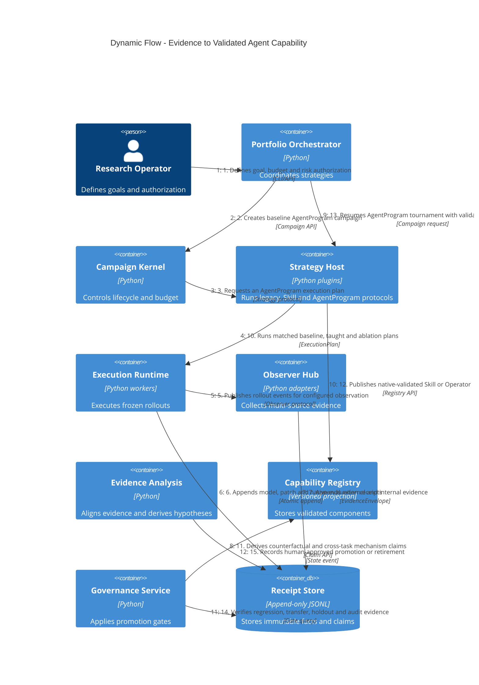

# v3.0 Dynamic Evolution Flow

该流程展示一次完整的“Evidence → 局部能力 → AgentProgram → 晋升”循环。第三代局部能力验证嵌套在第二代完整 AgentProgram 搜索中，第一代历史资产作为可重放 seed 输入。



## 关键流转

```text
Legacy evidence
→ verified seed
→ AgentProgram baseline
→ multi-source Evidence
→ Capability Gap
→ Skill/Operator paired validation
→ Capability Registry
→ AgentProgram tournament
→ regression/holdout/audit
→ human promotion
```

任何步骤失败都必须生成可重放 Receipt；失败、回归、中性和基础设施错误均保留，不得只保存成功路径。
