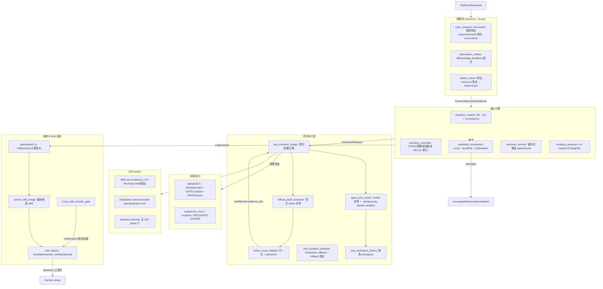

# Evolve × JLens 工具套件：架构与原理（供评估）

> 生成时间：2026-08-06。本文自包含，供其他 Agent 独立评估；所有结论均可在本仓库以只读命令复核。
> 项目根：`evolve-jlens-cluster`（非 git 仓库，靠 SHA-256 快照审计）。

## 0. 一句话定位

在**模型权重冻结**的前提下，用“JLens 观察轨迹 → 挖 PatternCard（可证伪假设）→ 提案 inactive ChangeSet（prompt/skills/policy/router/memory/harness）→ 真实 Codex/DeepSeek 多代搜索 + 官方 native evaluator 淘汰 → 收敛停止 → 候选 Skill + 跨任务迁移门”的闭环，做 Agent 应用层自进化；最终晋升必须人工。

## 1. 不可破坏的硬边界

- 模型权重冻结：不训练/SFT/LoRA/RL；不更换 Provider 凭证（当前 DeepSeek `deepseek-v4-flash`，custom provider）；
- JLens 仅 Observer：score-blind（不读 native 分数）、不产生正确性/准入位、`observational_not_causal`；
- native evaluator/safety/cost 是唯一准入依据（固定 evaluator epoch，不自动晋升）；
- final sealed 不打开；不做 production/global promotion；不装全局 Skill；
- 真实调用/任务/实例硬上限：2000 次真实 Codex 调用、100 个 search task、1 台临时实例；
- 实例清理：默认 **stop 保留**，仅用户明确“项目不做了”才 terminate（2026-08-05 用户指示）；
- 证据只增不改（append-only），负证据保留；已记账调用不重发。

## 2. 版本与阶段（全部有 MANIFEST 可验证）

| 阶段 | 职责 | 状态 |
|---|---|---|
| v0.1–v0.9 / v1.0 | Kernel→AgentProgram→JLens observer→PSI skill→受限代码变异→evaluator shadow→集成/加固→release | 冻结 accepted（v1.0.0 MANIFEST 5946 文件 valid） |
| v2.1.0 | Continuous A/B：300 题冻结池、shadow baseline、matched A/B、promotion/sealed audit | accepted；source-snapshot 于 2026-08-05 被操作者误改（修正案 024 收口，防篡改测试 xfail 文档化） |
| v2.1.1 | 真实多代搜索：G0 observe→G1-3 淘汰赛、真实 Codex 桥、断点续跑、逐臂证据冻结、优雅降级（候选 0-4） | 引擎 accepted；real-search-001 窗口 partial；real-search-002 运行中 |
| v2.2 | 收敛引擎：convergence_metrics、A 修复 B→generalized 卡、K=2 \|Δ\|<0.05 收敛停止、候选验证并行化 | implemented_tested（修正案 025） |
| v2.3 | 搜索→候选 Skill：编译 + 跨任务迁移门（≥8 对/非劣/safety/cost≤10%→transfer_verified/rejected）+ CLI | implemented_tested（修正案 026） |
| v2.4 健壮批次 | 冻结阶段防误写（FROZEN.json 守卫）、真实 run 接线 v2.2/v2.3（worker-count/skill-registry/auto-gate）、SIGTERM 优雅 partial | implemented_tested（修正案 027） |

## 3. 分层架构

## 4. 核心流程与原理

### 4.1 观察（当前实现与缺口）
- 当前真实运行用 `FrozenTrajectoryObserver`：只解析 **tool-events**（命令/编辑/测试），规则化特征（`inspection_observed/no_tests_observed/no_source_edit/inspect_before_edit/...`）；
- **已知缺口**：不读模型文本内容（events.jsonl 消息、last-message）——模型“说了什么”未参与观察；更不读取 hidden states（真·JLens 需要本地执行模型，尚未实现；v0.3 曾做层间 logit-lens/jlens，结论“未证明 jlens 优于 logit-lens”）；
- 观察是 score-blind 的，准入完全交给 native evaluator。

### 4.2 提案与锦标赛
- PatternCard（advantage/failure，observational_not_causal）→ MutationProposer 编译 0–4 个 inactive ChangeSet（六种 surface：prompt/skills/policy/router/memory_policy/constrained_harness_code）；
- rollback schema 严格 `{op,path,after}`（delete→after=null），候选物化后树哈希回滚验证；
- G1-3 每代 scout→semifinal→confirmation，native-evaluator-only 淘汰，实验谱系 `search_parent_advance`；
- 优雅降级：候选 0-4、G1 最低 1；失败候选进 `PROPOSAL-FAILURES.jsonl`（fail-closed，保留负证据）。

### 4.3 收敛与终止
- 每代输出 `convergence_metrics`（candidate-vs-original/parent 的 native_score/cost delta + safety）；
- 连续 K=2 代 mean|Δ|<0.05 且无 safety 回归 → `converged` 停止；终态三态 converged/exhausted/completed（窗口截断由操作者写 partial）；
- SIGTERM/INT → 原子写 `RESULT.partial`（修正案 027）。

### 4.4 Skill 落地
- selected candidate → `search_skill_bridge` 编译为项目内候选 Skill（inactive）；
- 跨任务迁移门：≥8 对 fresh-task（或 confirmation 配对证据）、native 非劣、无 safety 回归、cost≤10%、matched contract + 固定 evaluator epoch → `transfer_verified`；否则 `rejected`（负证据保留）；
- 永不 active/auto-install/global；人工晋升（`promotion-review` CLI 提供非变更评审清单）。

### 4.5 记账、恢复与审计
- controller 每次真实调用先 `reserve`（预算预扣，崩溃不重发），完成才 `record`；中断臂按 abort/重派发审计；
- 断点续跑幂等（resume 后指纹一致）；逐臂证据冻结 + `STATE.sha256` 规范摘要；
- `FROZEN.json` 守卫冻结阶段，`--freeze-override` 写审计记录（修正案 027）。

## 5. 当前验证状态（2026-08-06 实测）

- 全量 pytest：**375 passed + 1 xfailed**（xfail = 修正案 024 文档化的防篡改测试，strict=True 恢复即报警）；ruff check/format 全过；
- MANIFEST 全部 valid：v1.0.0（5946）、v2.1（22678）、v2.2（292）、v2.3（109）；
- fixture pass³ 指纹稳定：v2.2 `2a7bfd14…`（三次一致）；确定性、零网络；
- real-search-001-deepseek-v3：窗口截止 partial（G0+G1 scout/semifinal 完成，confirmation 2/36），证据已回传本地 `artifacts/…/runs/real-search-001-deepseek-v3/`（STATE `a5c06e0a…`）；
- real-search-002：运行中（AWS i-0b49272b2d58d034b），G0 完成、G1 scout 推进中；镜像预构建完成（sweb.eval 60 + mswebench 46+）。

## 6. 已知设计问题 / 开放问题（评估重点）

1. **JLens 观察缺口**：当前 observer 只读工具轨迹；模型文本内容（B 层）与真·内部观测（本地模型执行轨，C）均未实现。观察与执行分离的取舍未定（DeepSeek API 无 hidden states）。
2. **收敛门基线间距敏感**：mean|Δ| 同时含 vs-original 与 vs-parent，original/parent 差 D 时最小可达 mean|Δ|≈D/2，ε=0.05 可能不可达；候选挤中间可能误判。建议改 vs-parent 或归一化（未实施）。
3. **终态优先级**：`next_request_count==0`（exhausted）先于 convergence 检查；“既无信号又收敛”会以 exhausted 终止（未重排）。
4. **v1.0.0 release 校验对源码面过敏**：新增 root/test `.py` 改变 clean-room bundle 成员与 RC 指纹，需重钉 + 重建 MANIFEST（v2.3 时 108→110）。建议 bundle 改显式冻结清单（未实施）。
5. **冻结快照事故**（修正案 024）：`v21_artifacts --snapshot-sources` 曾覆盖 v2.1.0-continuous-ab 快照 4 个文件（1 个已从会话记录恢复，4 个本地不可恢复）；现已加 FROZEN.json 守卫，但历史阶段 integrity 标记 degraded。
6. **并行验证真实风险未实测**：controller 已加 RLock，但真实 native evaluator 缓存并发与 codex 子进程并发未在实例验证（worker_count 建议 ≤2）。
7. **镜像构建成本**：每任务独立 4GB+ eval 镜像（60 个 sweb.eval），首次构建约 5h；当前无 S3/ECR 备份（MCP 用户无存储权限；用户选择不备份，实例 stop 保留即缓存）。
8. **计费**：m7i-flex.large on-demand ap-southeast-1 ≈ $0.1197/h（按秒，最小 1min）；停止后仅 EBS 250GB gp3 ≈ $24/月；公网 IP 漂移（无 EIP）。

## 7. 给评估者的问题清单

- 观察（工具轨迹）与准入（native evaluator）分离是否足够防止 Goodhart？PatternCard 作为可证伪假设的边界是否清晰？
- 收敛门（K=2, |Δ|<0.05）在基线间距不可控时是否会导致永不收敛或误收敛？应改为 vs-parent 还是归一化？
- 优雅降级（候选 0-4、G1 最低 1）是否在“无信号”与“低候选”之间正确权衡？
- 真实执行桥的 fail-closed 记账（reserve-before-dispatch、不重发、abort 审计）是否有漏洞？
- 并行验证（worker_count）在 2vCPU 实例 + 真实 evaluator 上的正确性/收益？
- Skill 迁移门（confirmation 配对证据当作 fresh-task）是否满足“跨任务”语义？
- JLens 观察若扩展到模型文本/内部层，应如何与 score-blind 边界共存？
