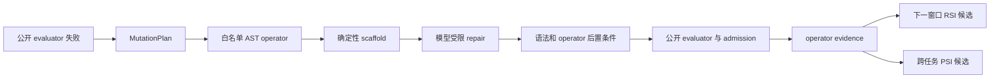

# 结构化 Mutation v4、RSI 与 PSI：实现和正式结果

## 1. 这轮实际做了什么

目标是把 JLens 发现的“搜索重复、软提示无法让 4B proposer 跳出模式坍缩”转成可执行的 Agent 优化，而不是让 JLens 直接控制模型输出。

实现包含：

- `MutationPlan` schema，只允许使用 prompt 中公开的 target failure；
- `canonicalize_before_predicate` 和 `finite_numeric_guard` 两类确定性 AST operator；
- 模型 repair 删除 operator 后置条件时，回退到确定性 scaffold；
- control 与 treatment 每个候选严格各用两次模型调用；
- audit 只保存 plan、operator、来源和哈希，不保存 hidden 数据、完整 prompt 或完整代码；
- 独立 seed 写入恢复契约，防止不同 seed 被误当成同一可恢复搜索；
- 单 seed capability 报告、三-seed 正式聚合报告、pooled operator evidence、RSI policy candidate 和 PSI skill candidate。

JLens 权限仍为 observer-only。它没有进入候选准入、operator 选择、公开/隐藏 evaluator 或模型权重更新。

## 2. 固定协议

- seeds：`20260802`、`20260803`、`20260804`；
- 每个 seed 两个 arm，每个 arm 10 个候选；
- 每候选 2 次模型调用，因此每个 arm 共 60 次调用；
- 固定 Qwen3.5-4B、初始程序、公开 evaluator、隐藏集、搜索参数和 admission；
- control：Call 1 自由计划，Call 2 自由编码；
- treatment：Call 1 解析结构化计划，执行确定性 operator，Call 2 只做受限 repair；
- 正式门要求 pooled 重复率严格下降、至少 2/3 seed 重复率不高于 control、公开/隐藏性能非劣、唯一 AST/行为不减少、零接受回归、operator 执行可审计。

## 3. 三 Seed 结果

| seed | control 公开/隐藏 | treatment 公开/隐藏 | 结构重复 control → treatment | 唯一 AST control → treatment | capability |
|---|---:|---:|---:|---:|---|
| 20260802 | 3/13，0/6 | 6/13，0/6 | 9/10 → 4/10 | 1 → 6 | pass |
| 20260803 | 4/13，0/6 | 4/13，0/6 | 7/10 → 8/10 | 3 → 2 | fail |
| 20260804 | 4/13，0/6 | 4/13，0/6 | 7/10 → 8/10 | 3 → 2 | fail |

聚合后：

- 结构重复从 `23/30`（76.67%）降到 `20/30`（66.67%）；
- 唯一 AST 逐 seed 求和从 7 升到 10；
- 唯一行为逐 seed 求和从 5 升到 8；
- 三个 seed 的公开和隐藏性能都没有劣于对应 control；
- 接受回归为 0，operator 后置条件执行可审计；
- 但只有 `1/3` seed 的重复率不高于 control，低于预声明的 `2/3` 要求。

因此正式决定是 **`rejected`**。pooled 指标改善是真实观察，但它主要由 seed 20260802 的单次强改善贡献，不能覆盖后两个 seed 的稳定退化。

## 4. 真正发现的规律

pooled operator evidence 覆盖 30 个 treatment 候选：

| 路径 | 尝试 | evaluator 有效 | 接受/公开改善 | 结构重复 |
|---|---:|---:|---:|---:|
| `canonicalize_before_predicate` | 22 | 22 | 5 | 17 |
| `free_form_rewrite` | 8 | 0 | 0 | 0 |

这说明：

1. **结构化 operator 能把“无效自由代码”变成可靠的可执行修复。** status operator 的 22 次执行全部满足后置条件并通过 evaluator 语法/运行有效性检查。
2. **单一确定性 scaffold 会产生新的模式坍缩。** 相同的 `(parent AST, target failure, operator)` 被重复执行，22 次中有 17 次是结构重复。
3. **operator 覆盖不足是第二个硬瓶颈。** status 修复后，下一个公开失败通常是 `normalize_user_identity`；当前没有对应 operator，于是 8 次全部回退自由编码，8 次全部 evaluator 无效。
4. **4B 的自由结构化计划没有成功工作。** 30/30 次模型计划都未通过 JSON schema，实际由公开 failure 的确定性映射兜底。当前收益不能归因于模型学会了规划。
5. **当前变化没有改善泛化。** 六个 arm 的隐藏分均为 0/6；“隐藏非劣”只代表没有更差，不代表产生了隐藏收益。

## 5. RSI 与 PSI 当前状态

### RSI

已生成三-seed pooled evidence 和版本化 policy candidate，但 `rsi_pass=false`。候选权重不能自动启用，原因有两层：

- proposer v4 的正式策略晋升已被拒绝；
- 即使策略通过，新的 operator 权重也必须在下一个独立固定预算窗口证明 improvement yield 和任务性能非劣，才算 operator-level RSI。

所以当前是“有可持久化的自改进候选”，不是“已经完成 RSI”。

### PSI

已把通用 operator schema、适用条件和聚合公开证据渲染成候选 `SKILL.md`，没有保存目标任务代码。但尚未在第二个相邻任务完成 `transfer/off` 匹配 A/B，因此仍是 PSI candidate，不是跨任务 PSI。

## 6. 下一版应该怎么修

1. 增加 `canonicalize_identity`、`drop_empty_identity`、聚合和数值验证 operator，覆盖 status 修复后的下一批公开失败。
2. 引入 archive-aware operator instance key：`(parent_ast, target_failure, operator_id, variant_id)`；已出现的 selected AST 不再提交 evaluator。
3. 为同一 operator 提供多个有后置条件的等价 variant，并在重复时轮换；variant 用尽后切换到下一个公开失败，而不是回到自由编码。
4. 对 Call 1 使用受约束 JSON decoding；若本地 4B 仍为 0% schema success，则把计划器改成公开 failure 的确定性编译器，并在 A/B 中如实减少或等价补齐调用预算。
5. v4.1 重新跑三个独立 seed。只有跨 seed 稳定性门通过，才进入下一窗口 RSI；随后再做相邻任务 PSI A/B。

## 7. 关键产物

- 正式中文报告：`../../outputs/JLens结构化Mutation-v4正式三Seed报告-2026-08-02.md`
- 正式机器结果：`../../outputs/jlens-structured-mutation-v4-formal-2026-08-02.json`
- pooled operator evidence：`runs/agent-ab-structured-v4-formal/operator_evidence.json`
- RSI policy candidate：`runs/agent-ab-structured-v4-formal/operator_policy_candidate.json`
- PSI skill candidates：`state/agent-ab-structured-v4/treatment/pooled_operator_skills/`
- 预声明评测协议：`evals/structured-mutation-v4.md`

结论：结构化变异方向值得保留，因为它显著提高了候选可执行性；当前实现不值得晋升，因为它把“自由生成坍缩”替换成了“单一 scaffold 坍缩”。
